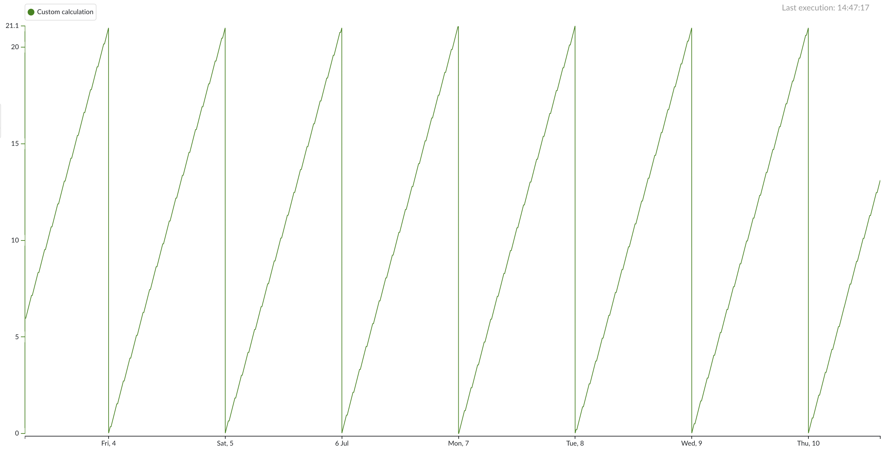
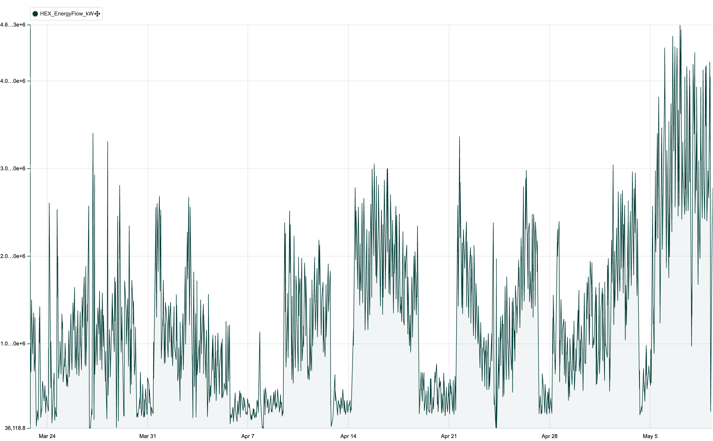
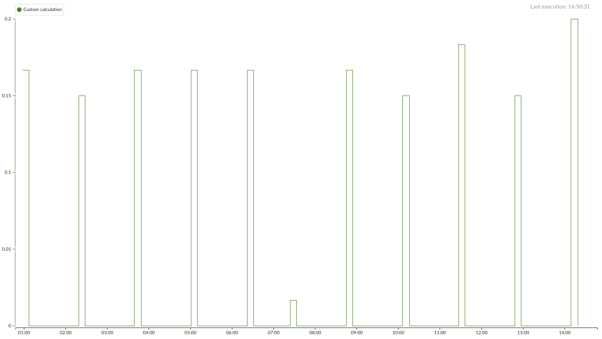

# Custom Calculations Examples

## Getting Started

Begin by exploring the [Custom Calculations Introduction notebook](custom_calculations_introduction.ipynb). It provides a concise overview of:

* Setting up tag dependencies
* Authenticating with the TrendMiner API
* Handling time zones and index intervals
* Retrieving data and performing value based searches
* Defining output formats and exporting results

This notebook is your first entry point into custom calculations.

## Example Scripts

All example scripts live in the `custom_calculations_scripts` directory. Each script is a standalone Python file demonstrating a common pattern for writing custom calculation tags in TrendMiner.

### Regular Intervals Examples

These examples cover the operations that happen on regular intervals. Daily, weekly, monthly, and yearly intervals can be generated with the `client.time.interval.range` method with `normalize=True`. Note that this approach does not work for hourly intervals, for which you need to write a custom function (returning all full hours that overlap with the index interval). Alternatively, you could opt to perform a value-based search for a built-in hour tag (e.g, TM_hour_Europe_Brussels) being constant.

#### [Block aggregation](custom_calculations_scripts/regular_intervals_examples/block_aggregation.py)
Apply aggregation functions (e.g., sum, average) on fixed time blocks within the index interval. This can be helpful for creating a tag for roll-up reporting or monitoring purposes.

#### [Event count](custom_calculations_scripts/regular_intervals_examples/event_counter.py)
This tag uses a value-based search to see how often the search criteria occur within a regular interval. It only counts the search results that actually start in the interval. This tag type can be used to create monitorable summary statistics on a batch, campaign, or continuous run of equipment whose condition can be defined by a search.

  
#### [Incrementing counter](custom_calculations_scripts/regular_intervals_examples/incrementing_counter.py)
Maintain a running count of events across the entire index interval and reset the counter after a defined period.

#### [Incrementing totalizer](custom_calculations_scripts/regular_intervals_examples/incrementing_totalizer.py)
Compute a cumulative sum of tag values over time, integrating continuously across blocks and reset the totalizer after a defined period.

#### [Incrementing duration totalizer](custom_calculations_scripts/regular_intervals_examples/incrementing_duration_totalizer.py)
This example creates an incrementing totalizer of search result durations (in hours). The totalizer resets at regular intervals (in  this example, every day).

### Search Results Examples
These examples cover the operations that happen on search results. A search is first performed, and the results of the custom calculation are then plotted at the times of the search results.

In these templates, as an example we will simply search for the day being a Monday, Wednesday or Friday.

#### [Block aggregations using calculations on search results](custom_calculations_scripts/search_results_examples/block_aggregations_calc_search_results.py)
Per search result, perform a custom calculation based on aggregations saved with the search. This allows you to delve deeper into the evolution of search aggregate calculations and well as perform custom calculations (ex. KPIs or empirical formulae) on them.

#### [Event count on search results](custom_calculations_scripts/search_results_examples/event_counter_for_search_results.py)
Per search result, count the number of results of a second search that start within it.This algorithm can be applicable to counting events within a particular timeframe (such as tank filling periods during a campaign or equipment defouling within a particular maintenance interval) or that a particular step occurs within a batch.

  
#### [Incrementing event counter](custom_calculations_scripts/search_results_examples/incrementing_event_counter_search_results.py)
Per main search result, have an incrementing counter for the results of a secondary search. This is similar to the last example’s application, but instead one single total count value, the counter starts at 0 and increments with 1 for every new result, resetting to 0 after the main search result concludes. This shows exactly when secondary results occured, and allows for more up to date indexing of the value rather than needing both search periods to conclude before calculating and indexing a value.

#### [Incrementing value totalizer](custom_calculations_scripts/search_results_examples/incrementing_value_totalizer_search_results.py)
Totalize a given tag over the course of a search result. Typically, we do not want to wait until search results are completed, or add a minimal duration to the search, as that would delay the totalizer. This tag type shows the evolution of the same event summary variables that can be obtained by calculations on search results, allowing for monitoring and proactive response to deviation from expected values.

#### [Ignore short gaps](custom_calculations_scripts/search_results_examples/ignore_short_gaps.py)
Put a value of 1 when a value-based search is True, but ignore gaps between results which are shorter than a given threshold

### Coolprop examples
These examples cover the use of the thermodynamics Python package [Coolprop](http://www.coolprop.org/coolprop/wrappers/Python/index.html) you can use this package to calculate new KPI's which are not directly measuerd by a sensor.

#### [Heat Exchanger energy flow](custom_calculations_scripts/coolprop_examples/heat_exchanger_energy_flow.py)  
In a steam–water shell-and-tube exchanger, fouling and scale buildup gradually reduce the actual heat transferred—but raw temperature or flow tags alone won’t tell you exactly how much energy is being moved. This demo shows how to turn four live process tags into an _instantaneous_ heat-duty signal in kW, using the PyFluids/CoolProp engine under the hood.

**What the Tag Does**
1. **Reads** these dependencies at 1 min resolution:  
   - Inlet temperature (°C)  
   - Inlet pressure (bar)  
   - Fluid density (kg / m³)  
   - Volumetric flow (m³ / s)  

2. **Calculates specific enthalpy**  
   Uses the IAPWS-IF97 correlations in CoolProp to look up water enthalpy \(h\) [kJ/kg] at each timestamp.

3. **Builds mass flow**  
   $\dot{m}$ [kg/s] = density × volumetric flow.

4. **Computes instantaneous heat duty $\dot{Q}$:**
   $$
     \dot{Q} = \dot{m} \times h
   $$
   where:
   - $\dot{m}$ [kg/s] is the mass flow rate.
   - $h$ [kJ/kg] is the specific enthalpy.

5. **Result** an Analog tag (`HEX_EnergyFlow_kW`) in TrendMiner.

### Custom Examples
A collection of more use-case-specific examples.

#### [Downtime before startup](custom_calculations_scripts/custom_examples/downtime_before_startup.py)
In this example, we will put the hours of downtime before a startup as a discrete tag over the startup phase. The downtime before startup can be used to categorize the startup itself, as the amount of time the equipment was out of operation can have a significant effect on the startup process. 

Startups are defined as the periods that fall between downtime and stable operation (both of which are defined as a value-based search). The downtime in hours is placed as a discrete tag over the startup which follows that downtime. During the downtime itself, our tag will have a value of 0. This way, a search on our downtime duration tag will directly yield the startup period.

---

Feel free to copy or adapt any of these scripts for your own custom calculations in TrendMiner and if you have any questions you can always reach us on the [TrendMiner community](https://community.trendminer.com)!

---